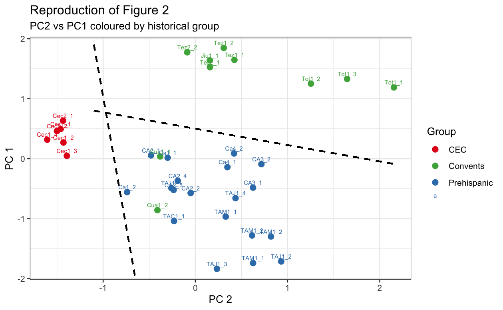

```{r}
#| include: false
source("Presentation_Data.R")
```

## Questions to Answer

There are 4 main questions that we set out to answer during this project

1.  Are there any surprising observations in the data?

2.  Can we assume that the data follows a multivariate normal distribution?

3.  Can we find groups in this data?

4.  Can we recreate figure 2 from the original study?

## Figure 2. from the original Paper
{width=50%}

We were able to reproduce a similar version of Figure 2 from the original study. The reproduced analysis shows broad Prehispanic and Colonial patterns, while the CEC samples form a more distinct group. However, the substantial overlap between samples indicates that the groups are not completely separated, which is consistent with the authors’ conclusions.

## Data Transformation
{width=70%}

## Are There Surprising Observations?

```{r}
#| echo: false
knitr::kable(dm_results)
```

The largest Mahalanobis distances identify samples with unusual combinations of elemental concentrations. TAJ1_4 is the most extreme observation, suggesting that its overall elemental profile differs most strongly from the centre of the dataset.

## Pairs Plot of Mahalanobis Distances and Contour Densities.
```{r}
#| echo: false
#| fig-width: 6.5
#| fig-height: 3.0
pairs
```
 The pairs plot compares the elemental variables two at a time. Highlighted observations indicate samples with unusual multivariate behaviour, while the contour lines show where observations are more densely concentrated. This helps identify possible outliers and relationships among the saved
 elemental concentrations.

## Can we assume that the data follows a multivariate normal distribution?

No. The data cannot be assumed to follow a multivariate normal distribution because it fails Mardia’s skewness test, although the kurtosis result is consistent with normality. Several individual elements also show evidence of non-normality, including calcium, phosphorus, manganese and nickel. Therefore, the multivariate results should be interpreted with caution.

## Can we find groups in this data?
{width=55%}

The analysis provides evidence of some meaningful grouping, particularly the CEC samples, which form a distinct group. However, the Prehispanic and Colonial samples overlap substantially and are not completely separated. Therefore, there is some structure in the data, but the groups are not all clearly distinct.

## Discussion
The analysis of elemental concentrations within Maya blue samples provides evidence of structure, although the groups are not completely distinct. Taking a log transformation of the data helped to account for large differences in concentration levels between the elements, which is consistent with the approach used in the original study. However, the data cannot be assumed to follow a multivariate normal distribution, as it fails Mardia’s skewness test, despite the kurtosis result showing consistency with normality. Several of the individual elements also showed evidence of non-normality; these elements were calcium, phosphorus, manganese and nickel. This should be taken into consideration when interpreting the multivariate results.

## Discussion Continued
The data also showed some surprising observations. TAJ1_4 had the biggest Mahalanobis distance and was classified as surprising, while Tot1_1, TAJ1_1, Jiu1_1 and Cec1_3 were all classified as somewhat surprising. The clustering analysis provides evidence of some meaningful groups in the data, with the CEC samples forming a distinct group. This is consistent with the authors’ observation of these samples containing unusually low calcium concentrations and likely not being produced with the fresco technique. The samples also show a less clear distinction between predominantly Prehispanic and Colonial samples, as these two groups have substantial overlap rather than being completely separated.

## Discussion Continued 2
We agree with the authors’ conclusions about the zones in Figure 2. The original PCA differentiated samples into broad Prehispanic and Colonial patterns and identified CEC as a distinct cluster. They also concluded that the data did not form well-defined groups. We were able to reproduce a similar graph, providing evidence of these findings. Elemental composition provides information about the historical period and the technique used, but the overlap between samples means that the groups cannot be treated as completely separated categories. The authors’ hypothesise that the overlap may be due to similarities in the painting techniques between the Prehispanic and Colonial periods.

## Conclusion
Overall, the results show some structure in the Maya blue samples, but the groups are not completely distinct. The CEC samples are clearly separated, while the Prehispanic and Colonial samples overlap. Figure 2 supports the authors’ conclusion that the zones represent broad patterns rather than clearly defined groups.

## References
Sánchez del Río, M., Martinetto, P., Solís, C., & Reyes-Valerio, C. (2006).
*PIXE analysis on Maya blue in Prehispanic and colonial mural paintings*.
Nuclear Instruments and Methods in Physics Research Section B, 249, 628–632.
doi:10.1016/j.nimb.2006.03.069
