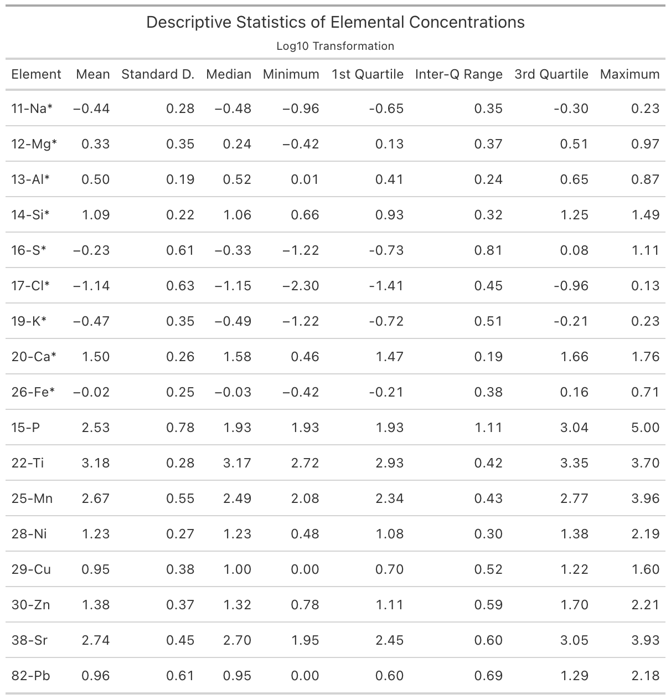

```{r}
#| include: false
source("Presentation_Data.R")
```

## Overview of Project

## Questions to Answer

There are 4 main questions that we set out to answer during this project

1.  Are there any surprising observations in the data?

2.  Can we assume that the data follows a multivariate normal distribution?

3.  Can we find groups in this data?

4.  Can we recreate figure 2 from the original study?

## Background

## Original Data

## Figure 2. from the original Paper

## Data Transformation

{width=70% fig-align="center"}

## Methodology

## Quantitative Description

## Qualitative Description

## Are There Surprising Observations?

## Pairs Plot of Mahalanobis Distances and Contour Densitys.

## Can we assume that the data follows a multivariate normal distribution?

## Can we find groups in this data?

```{r}
#| echo: false
plot(PCA_log, type="l")
```

## Discussion

## References
